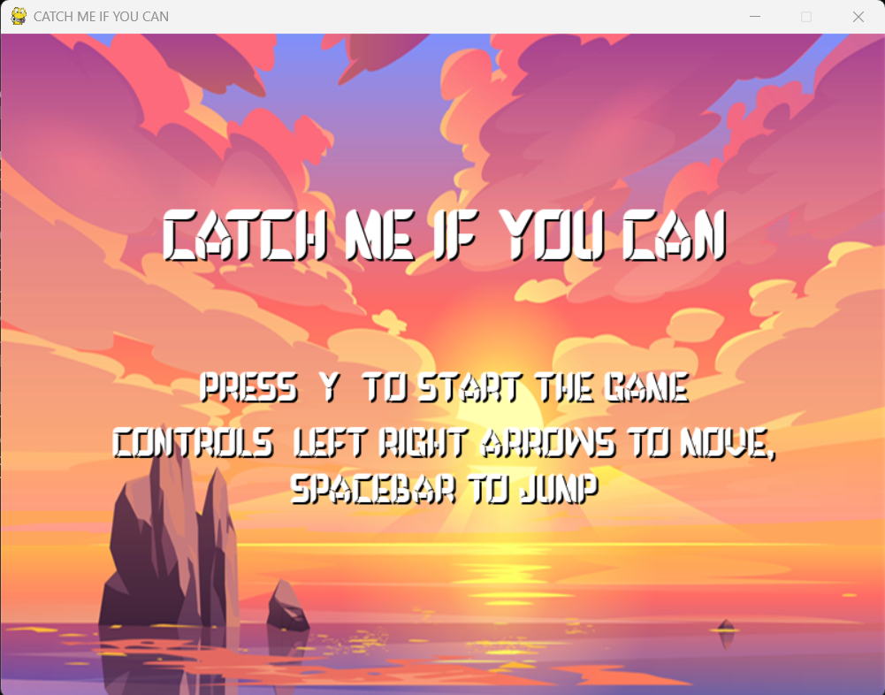
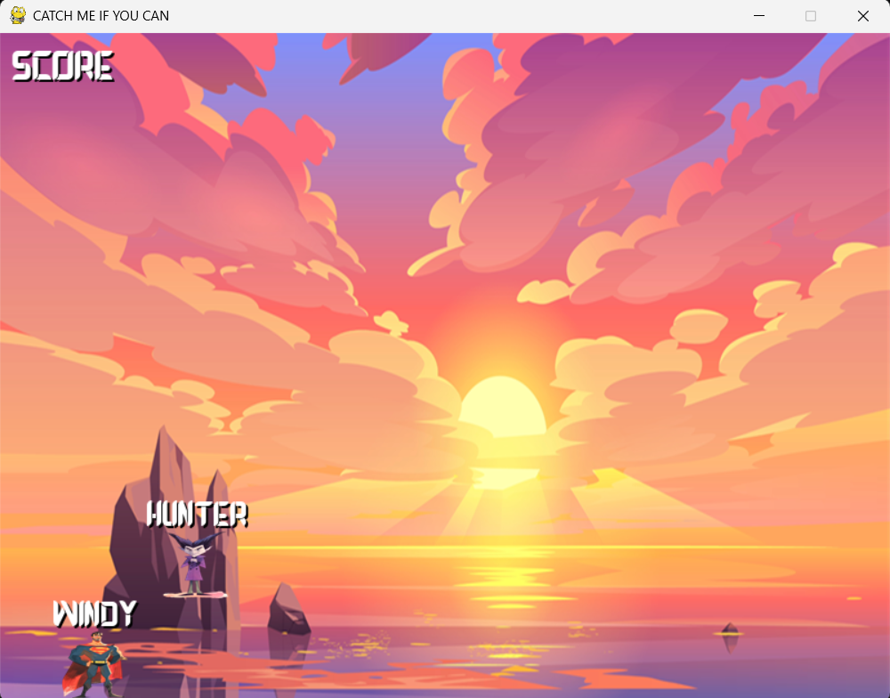
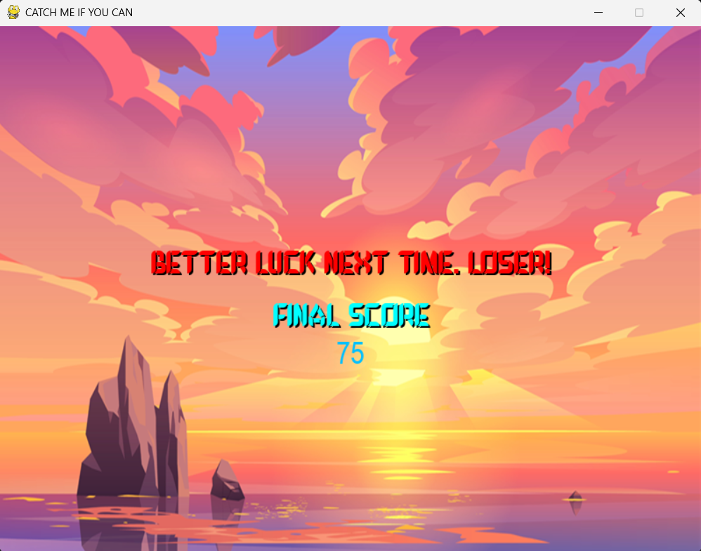

# 🎮 CATCH ME IF YOU CAN – AI-Powered Platformer





A 2D platformer game developed using **Pygame**, featuring an intelligent enemy AI (**Tanisha**) driven by a **Long Short-Term Memory (LSTM) neural network**. This project demonstrates real-time machine learning integration, where the AI dynamically learns and predicts player movements to deliver a challenging and engaging chase experience.

---

## ✨ Key Features

* **Responsive Player Controls:** Smooth and intuitive movement (left, right, jump) for the player character (Ayaan).
* **Intelligent AI Opponent (Tanisha):** An LSTM-based AI that predicts player trajectories, enabling dynamic and adaptive pursuit.
* **Dynamic Graphics & Assets:** Custom character sprites for both player and enemy, alongside a thematic background image, bringing the game world to life.
* **Polished User Interface:** Features a custom, stylized font, a clear title screen, and a concise game-over screen with immediate score feedback.
* **Survival Scoring System:** A time-based score that challenges players to evade the AI for as long as possible.

---

## 🧠 AI Architecture & Implementation (LSTM Model)

This project leverages TensorFlow/Keras to implement a predictive AI for the enemy character:

### Model Overview

* **Model Type:** Long Short-Term Memory (LSTM) neural network. LSTMs are particularly well-suited for sequence prediction tasks, making them ideal for anticipating player movement patterns over time.
* **Architecture:** A sequential model comprising an LSTM layer (e.g., 64 units) followed by a Dense output layer (1 unit, predicting X-position).
* **Objective:** To learn the correlation between past player movement sequences and their subsequent positions.

### Data & Training

* **Training Data:** Player movement data (specifically, `x_position` and implicitly, their jump state through sequence changes) is recorded and stored in `movement_data.csv`. This dataset represents a historical record of player behavior.
* **Training Script (`train_enemy_lstm.py`):** This script is responsible for:
    * Loading and preprocessing the `movement_data.csv`.
    * Normalizing input data using `MinMaxScaler`.
    * Creating time-series sequences from player movements.
    * Training the LSTM model to predict the next player `x_position`.
    * Saving the trained model (`enemy_lstm_model.keras`) and scaler parameters (`scaler_min.npy`, `scaler_max.npy`) for in-game use.

### Real-time Inference & Optimization

* **In-Game Prediction (`platformer_game.py`):** During live gameplay, the enemy AI:
    * Continuously collects a sequence of the player's recent `x_position` data.
    * Feeds this scaled sequence into the loaded `enemy_lstm_model.keras`.
    * Utilizes the model's prediction for the player's next `x_position` to guide its own movement.
* **Performance Optimization:** To ensure smooth real-time gameplay, AI predictions are executed on a controlled `prediction_interval` (e.g., every 8 frames), minimizing computational overhead without sacrificing responsiveness. This addresses common challenges of integrating ML inference into game loops on CPU-bound systems.

---

## 🛠️ Getting Started

### ✅ Prerequisites

* **Operating System:** Windows, macOS, or Linux
* **Python:** Version 3.10 or higher
* **Environment Management:** [Anaconda](https://www.anaconda.com/products/individual) or [Miniconda](https://docs.conda.io/en/latest/miniconda.html) (highly recommended for dependency management)
* **Version Control:** [Git](https://git-scm.com/downloads)

### 📦 Installation

1.  **Clone the Repository:**
    ```bash
    git clone [https://github.com/ayaanshaikh2563/ml-platformer-game.git](https://github.com/ayaanshaikh2563/ml-platformer-game.git)
    cd ml-platformer-game
    ```
    *(Remember to replace `ml-platformer-game` if you named your repository something else on GitHub.)*

2.  **Create and Activate Conda Environment:**
    ```bash
    conda create -n tf_env python=3.10
    conda activate tf_env
    ```
    *If you encounter issues with `conda` not being recognized in your regular terminal, use the "Anaconda Prompt" or "Miniconda Prompt" from your Start Menu.*

3.  **Install Dependencies:**
    ```bash
    pip install -r requirements.txt
    ```

---

## 🚀 Running the Game

1.  **Train the Enemy AI Model:**
    * Ensure your `tf_env` Conda environment is active.
    * Navigate to the project directory in your Anaconda Prompt.
    * Run the training script. This will generate `enemy_lstm_model.keras`, `scaler_min.npy`, and `scaler_max.npy`:
        ```bash
        python train_enemy_lstm.py
        ```

2.  **Launch the Game:**
    * From the same Anaconda Prompt (with `tf_env` active), run:
        ```bash
        python platformer_game.py
        ```
    * **Optional (Windows Batch File):** For quicker launches, you can create a `.bat` file (e.g., `launch_game.bat`) in your project root with the following content:
        ```bash
        @echo off
        call conda activate tf_env
        cd /d "%~dp0"
        python platformer_game.py
        pause
        ```
        *(Note: `%~dp0` in the batch file ensures it always changes directory to where the batch file itself is located.)*

---

## 🎮 Controls

* **Start Game:** Press 'Y' on the title screen.
* **Move Left:** ← (Left Arrow Key)
* **Move Right:** → (Right Arrow Key)
* **Jump:** Spacebar

---

## 📈 Future Enhancements (Roadmap)

* **Level Progression:** Introduce multiple stages with varying layouts and obstacles.
* **Collectibles/Power-ups:** Add items that grant temporary abilities to the player.
* **Improved AI:** Explore more advanced AI models or techniques (e.g., Reinforcement Learning, A\* pathfinding for smarter evasion/interception).
* **Expanded Animation Set:** Implement more dynamic character animations (e.g., running, idle, fall).
* **Sound Design:** Integrate background music and diverse sound effects for actions and events.

---

## 🧑‍💻 Author

**Ayaan**
* [GitHub Profile](https://github.com/ayaanshaikh2563)
* [LinkedIn Profile](https://www.linkedin.com/in/your_linkedin_username) ---

## 📄 License

This project is open-source and available under the [MIT License](https://opensource.org/licenses/MIT). You can read the full license text in the `LICENSE` file.

---